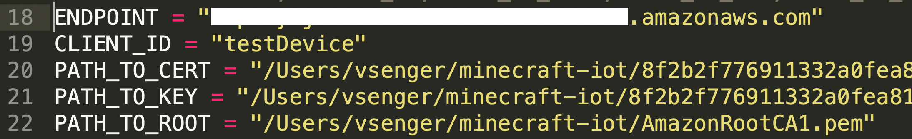

Amazon Rekognition AI2IoT Agent
===============================

This demo illustrates the [Amazon Rekognition][1] capabilities when detecting faces and labels through your computer's webcam. For that, we are going to use the [AWS SDK for Python (boto3)][2] and the [Rekognition Image API][3]. You will also need Python>=3.6 installed.

  

## Setup

You are going to need the [boto3][4] and [opencv-python][5] packages. For better compatibility, you can install the exact same library versions used during the development of this demo running:

    pip install -r requirements.txt

Make sure you have also configure the [authentication credentials][6] on your computer.

## Setup AWS IoT Core Credentials

We will need to create a thing on AWS IoT Core to represent this agent as an IoT device and provide certificate and keys and we show how to do it step-by-step here: https://github.com/vsenger/Playground4AWS/tree/main/minecraft#3-configure-aws-iot-core

Once you have your certificate and keys created and downloaded to you computer you can change the computer path to point to the folder you've downloaded it; and also we need to setup the AWS IoT Core endpoint:

 

## Running

Now it's time to run the script and check if you have messages arriving on AWS IoT Core console:

    python3 ai2iot.py

You can open your AWS IoT Core testing console and check if you are receiving MQTT messages with helmet and mask information:

1. Open AWS IoT Core console
2. Click Test - MQTT test client
3. Subscribe to the topic gaming/ai
4. Put a helmet to see if you receive a JSON message

 

[1]: https://aws.amazon.com/rekognition/
[2]: https://boto3.amazonaws.com/v1/documentation/api/latest/index.html
[3]: https://docs.aws.amazon.com/rekognition/latest/dg/API_Reference.html
[4]: https://pypi.org/project/boto3/
[5]: https://pypi.org/project/opencv-python/
[6]: https://boto3.amazonaws.com/v1/documentation/api/latest/guide/quickstart.html#configuration
